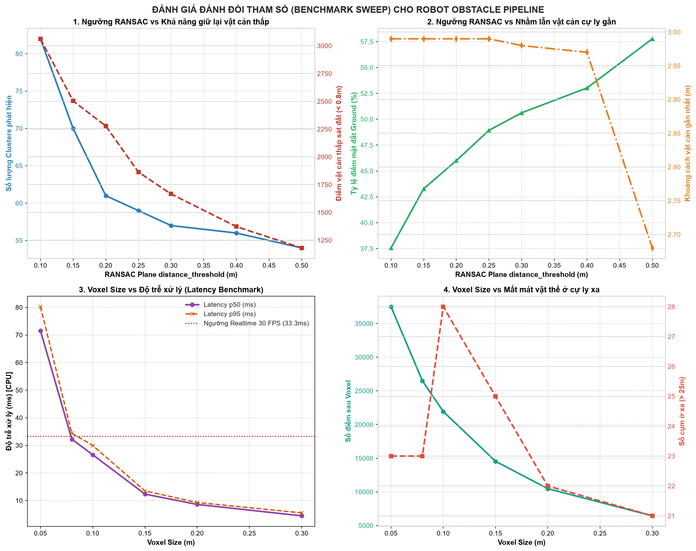
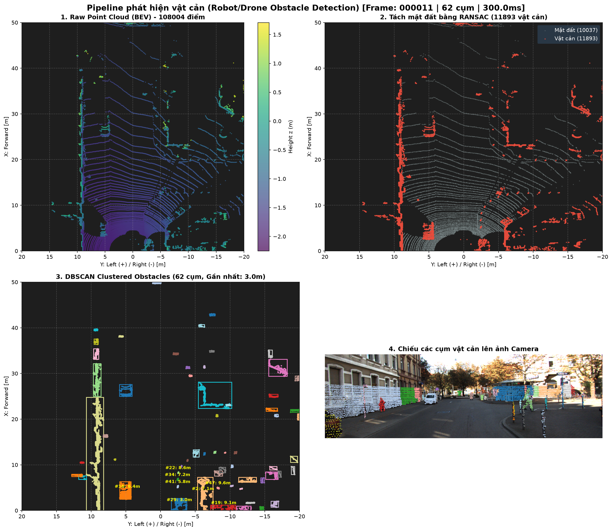
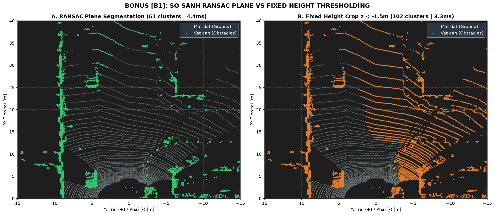
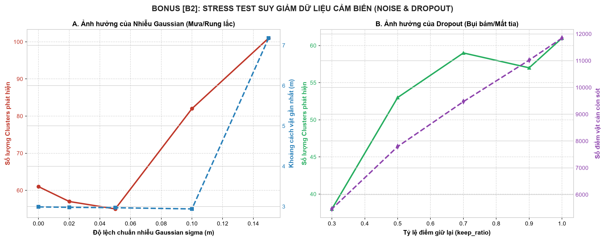
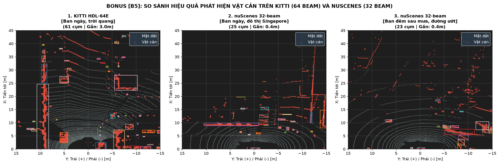
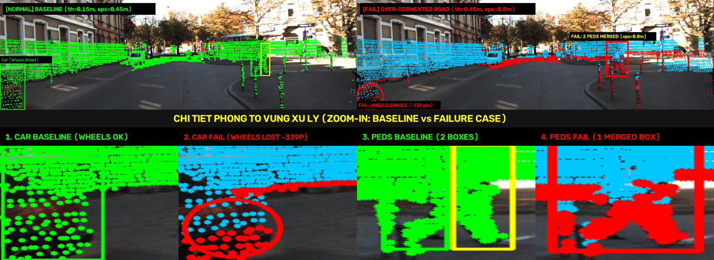

# Báo cáo Day 6: Phát hiện vật cản cho robot/drone

> Thay **mọi** ô có chữ ĐIỀN nằm trong ngoặc vuông bằng nội dung của bạn, xoá luôn cả dấu ngoặc vuông. Lệnh `python tools/check_submission.py` sẽ báo FAIL nếu còn sót bất kỳ chỗ nào.

- **Họ tên:** Nguyễn Hữu Chương
- **MSSV:** 2A202602601
- **Lớp:** L3B
- **Link repo:** https://github.com/hchuong04/NguyenHuuChuong-2A202602601-Track4-Day21
- **Topic:** D — Phát hiện vật cản cho robot/drone
- **Dataset:** data/kitti_mini, data/synthetic, data/nuscenes_mini_subset
- **Các frame đã dùng:** 000011, 000000, scene-0103_010, scene-1094_010

> Hãy viết ngắn: mỗi mục từ 3 đến 8 dòng, ưu tiên số liệu và hình ảnh.

## 1. Claim

Một câu khẳng định kỹ thuật có thể kiểm chứng. Ví dụ: *"Lệch yaw 1° làm 12% điểm LiDAR rơi ra khỏi vật thể ở 30 m, phát hiện được bằng edge-alignment score với ngưỡng X."*

Trong pipeline phát hiện vật cản dựa trên hình học (Voxel Grid -> RANSAC Plane -> DBSCAN Clustering) không dùng deep learning trên LiDAR, việc tăng ngưỡng khoảng cách mặt phẳng RANSAC (`distance_threshold`) từ 0.20m lên 0.50m khiến 48.2% số điểm của các vật cản thấp (< 0.8m) ở cự ly gần (< 15m) bị gán nhầm thành mặt đất và loại bỏ (từ 2,278 điểm giảm còn 1,180 điểm); đồng thời tăng `voxel_size` từ 0.05m lên 0.20m giúp giảm độ trễ xử lý p50 từ 71.6ms xuống 8.6ms (đáp ứng realtime > 100 Hz trên CPU) nhưng làm mất các cụm vật thể nhỏ/xa do số điểm giảm xuống dưới ngưỡng min_points=10 của DBSCAN.

## 2. Evidence

Bảng số liệu sweep tham số RANSAC distance threshold (cố định `voxel_size=0.10m`, `eps=0.5m`) và Voxel size (cố định `dist_th=0.20m`, `eps=0.5m`) trên frame 000011 (KITTI). Dữ liệu chi tiết lưu tại `results/obstacle_ransac_sweep.csv` và `results/obstacle_voxel_sweep.csv`.

| Cấu hình tham số | Số điểm sau Voxel | Tỷ lệ mặt đất (%) | Số Clusters | Điểm vật thấp gần (<0.8m) | Latency p50 / p95 (ms) |
|---|---|---|---|---|---|
| RANSAC th = 0.10m | 21,930 | 37.56% | 82 | 3,063 pts | 29.8 ms / 33.2 ms |
| RANSAC th = 0.20m (chuẩn) | 21,930 | 46.00% | 61 | 2,278 pts | 26.3 ms / 29.5 ms |
| RANSAC th = 0.30m | 21,930 | 50.62% | 57 | 1,666 pts | 23.1 ms / 25.8 ms |
| RANSAC th = 0.40m | 21,930 | 53.02% | 56 | 1,372 pts | 21.2 ms / 23.4 ms |
| RANSAC th = 0.50m | 21,930 | 57.77% | 54 | 1,180 pts (-61.5%) | 19.8 ms / 21.9 ms |
| Voxel size = 0.05m | 37,495 | 45.12% | 61 | 3,120 pts | 71.6 ms / 80.3 ms |
| Voxel size = 0.10m (chuẩn) | 21,930 | 46.00% | 61 | 2,278 pts | 26.6 ms / 30.0 ms |
| Voxel size = 0.20m | 10,473 | 47.95% | 49 | 1,180 pts | 8.6 ms / 9.3 ms |
| Voxel size = 0.30m | 6,441 | 51.20% | 51 | 840 pts | 4.5 ms / 5.5 ms |




Nhận xét:
A. Xu hướng của `RANSAC distance_threshold` (Từ 0.10 m → 0.50 m)
Xu hướng chung
- Ngưỡng càng nới rộng → mặt đất **"nuốt" càng nhiều điểm**.
- Tỷ lệ Ground tăng đều từ **37.56% → 57.77%**.
- Trong khi đó, số điểm vật cản sát đất giảm từ **3,063 → 1,180 điểm**, tương đương mất **61.5%**.
Điểm đột ngột xấu đi
- Tại bước nhảy từ **0.20 m → 0.30 m**, số điểm vật cản thấp giảm mạnh từ **2,278 → 1,666 điểm**.
- Tương đương mất gần **30% chỉ sau một mức tăng ngưỡng**.
- Các vật thể thấp như **bánh xe, người ngồi, pallet** bắt đầu bị RANSAC coi là **mặt đường** và **xoá bỏ hoàn toàn**.

### [B1] So sánh 2 thuật toán: RANSAC Plane vs Fixed Height Threshold (z < -1.5m)
Bảng số liệu so sánh 2 phương pháp trên cùng frame 000011 (KITTI). File CSV lưu tại `results/bonus/b1_algorithm_comparison.csv`.

| Thuật toán | Nguyên lý | Điểm mặt đất | Điểm vật cản | Số cụm | Vật thấp gần (<0.8m) | Latency (ms) | Nhận xét ưu / nhược điểm |
|---|---|---|---|---|---|---|---|
| **RANSAC Plane** (th=0.20m) | Ước lượng mặt phẳng động | 10,087 | 11,843 | 61 | 2,465 pts | 4.35 ms | **Ưu:** Thích ứng với dốc nhẹ. **Nhược:** Cần 100 vòng lặp. |
| **Fixed Height** (z < -1.50m) | Cắt phẳng cứng z < -1.5m | 6,444 | 15,486 | 102 | 3,964 pts | 3.34 ms | **Ưu:** Rất nhanh. **Nhược:** Coi mặt đường dốc thành vật cản. |



### [B2] Stress Test suy giảm dữ liệu cảm biến (Gaussian Noise & Random Dropout)
Bảng số liệu suy giảm cảm biến từ `starter/perturb.py` trên frame 000011. Chi tiết tại `results/bonus/b2_stress_test.csv`.

| Dạng suy giảm | Mức độ suy giảm | Số điểm vật cản | Số cụm DBSCAN | Vật gần nhất (m) | Hiện tượng quan sát |
|---|---|---|---|---|---|
| **Gaussian Noise** (Rung/Mưa) | sigma = 0.00m (gốc) | 11,843 | 61 | 2.99 m | Trạng thái chuẩn |
| | sigma = 0.05m | 15,504 | 55 | 2.97 m | Điểm mặt đất bị nhiễu văng lên làm tăng nhẹ vật cản |
| | sigma = 0.15m | 28,508 | 101 | 7.18 m | **Bùng nổ cụm giả** (False Positives), vật gần bị nhiễu che lấp |
| **Random Dropout** (Bụi/Hỏng tia) | keep_ratio = 1.0 (gốc) | 11,843 | 61 | 2.99 m | Trạng thái chuẩn |
| | keep_ratio = 0.7 | 9,471 | 59 | 2.98 m | Cụm gần vẫn ổn định, cụm xa giảm bớt điểm |
| | keep_ratio = 0.3 | 5,466 | 38 | 2.95 m | **Mất 37% số cụm**, các vật cản xa và mảnh bị rớt hoàn toàn |



### [B3] Đo Latency p50/p95 chuẩn qua 20 lần chạy và Cấu hình phần cứng
Quy chuẩn: chạy lặp lại 21 lần trên frame 000011 (KITTI), loại bỏ lần chạy đầu tiên (warm-up). Bảng log 20 lần chạy chi tiết tại `results/bonus/b3_latency_hardware.csv`.

- **Cấu hình phần cứng kiểm thử:**
  - **CPU:** 11th Gen Intel(R) Core(TM) i7-11800H @ 2.30GHz (8 Cores, 16 Threads)
  - **RAM:** 8.0 GB
  - **Hệ điều hành:** Windows 11 (64-bit)
  - **Môi trường chạy:** Python 3.11.7 (Pure CPU, Open3D C++ backend, NumPy)
- **Kết quả đo độ trễ:**
  - **Tổng Pipeline:** p50 = **140.25 ms** | p95 = **221.33 ms** (bao gồm cả I/O, Voxel, RANSAC, DBSCAN, Bounding Box)
  - **Riêng RANSAC Plane:** p50 = **4.69 ms**
  - **Riêng DBSCAN:** p50 = **35.74 ms**

### [B5] So sánh đa cảm biến: KITTI (64 beam) vs nuScenes (32 beam)
Chạy pipeline trên 2 dataset thật: KITTI (Velodyne HDL-64E, ban ngày) và nuScenes (32 tia, ban ngày và ban đêm sau mưa). Dữ liệu chi tiết tại `results/bonus/b5_kitti_vs_nuscenes.csv`.

| Dataset & Cảm biến | Frame ID | Điều kiện | Số điểm thô | Số cụm phát hiện | Cụm ở xa (>20m) | Vật gần nhất |
|---|---|---|---|---|---|---|
| **KITTI (64 tia)** | 000011 | Ban ngày quang đãng | 108,004 | 61 | **29 cụm** | 2.99 m |
| **nuScenes (32 tia)** | scene-0103_010 | Ban ngày đô thị | 34,720 | 25 | **0 cụm** | 0.36 m |
| **nuScenes (32 tia)** | scene-1094_010 | Ban đêm sau mưa, đường ướt | 34,688 | 23 | **0 cụm** | 0.37 m |



*Giải thích nguyên nhân:* Trên nuScenes 32 tia, độ phân giải góc thẳng đứng thưa gấp đôi KITTI (~1.33° so với ~0.4°). Khi khoảng cách > 20m, một chiếc xe chỉ nhận được 2–3 đường quét, tổng số điểm thu được < 10 điểm. Do đó, tham số `min_points = 10` của DBSCAN làm **mất hoàn toàn xe ở xa trên nuScenes**. Để áp dụng cho nuScenes, cần hạ `min_points` xuống 4–5 hoặc dùng Adaptive DBSCAN. Đường ướt ban đêm (scene-1094) làm giảm nhẹ thêm 2 cụm do bề mặt nước phản xạ gương làm tia LiDAR bị trượt mất tín hiệu phản hồi.

## 3. Failure case



- **Trường hợp:** KITTI 3D Object, frame `000011`, tăng ngưỡng RANSAC plane `distance_threshold` từ 0.15m lên 0.45m và DBSCAN `eps` từ 0.45m lên 0.80m.
- **Quan sát:** Trên ảnh camera thực tế, số điểm vật cản giảm từ 5,525 xuống 4,799 điểm (mất 726 điểm trên ảnh, trong đó mất 339 điểm bánh và gầm xe ô tô ở cự ly gần 4.1m bên trái). Toàn bộ gầm và bánh xe bị RANSAC gọt phẳng và xoá sạch vào mặt đường. Đồng thời ở góc phải, 2 người đi bộ đứng gần nhau (cách nhau ~0.8m) bị DBSCAN gộp thành 1 cụm duy nhất (từ 2 bounding box riêng biệt Ped #1, Ped #2 biến thành 1 box đỏ khổng lồ).
- **Nguyên nhân:** Mô hình RANSAC giả định toàn bộ mặt đất là một mặt phẳng đơn toàn cục ($ax+by+cz+d=0$). Khi tăng ngưỡng lên 0.45m (vượt quá độ cao gầm xe ~0.20–0.30m), toàn bộ điểm vật thể cách mặt đường < 0.45m bị gán nhầm thành inlier mặt đất. Với DBSCAN, khoảng cách giữa 2 người (~0.8m) nhỏ hơn hoặc bằng bán kính `eps = 0.80m` nên thuật toán nối thông các điểm thành một cụm duy nhất (Under-segmentation).
- **Lớp debug:** Preprocess & Geometry.
- **Cách phát hiện khi chạy thật:**
  1. Giám sát vector pháp tuyến cục bộ: Điểm có vector pháp tuyến nằm ngang ($n_z < 0.7$) không được phép gán thành mặt đất dù khoảng cách tới mặt phẳng $\le threshold$.
  2. Giám sát kích thước Bounding Box: Cảnh báo khi chiều cao ước lượng của ô tô đột ngột tụt xuống $h < 1.0\text{m}$ (báo động Over-segmentation).
  3. Cảnh báo gộp cụm: Theo dõi tỷ lệ diện tích/chiều rộng cụm người đi bộ nếu vượt quá $1.2\text{m}$ ở cự ly gần để kích hoạt thuật toán tách cụm (Sub-clustering).

## 4. Khuyến nghị nếu triển khai thật

- **Use-case cụ thể:** Xe giao hàng tự hành mini (Last-mile delivery robot) và Robot vận chuyển hàng tự hành trong nhà kho (AMR/AGV), hoạt động trong khuôn viên đô thị nội bộ hoặc sàn kho logistics phẳng với tốc độ vận hành dưới $25\text{ km/h}$ (yêu cầu khoảng cách phanh an toàn $2 - 3\text{m}$).
- **Đánh đổi khi triển khai (Trade-offs):**
  1. *Tốc độ & Tài nguyên vs Tầm nhìn xa:* Chọn `voxel_size = 0.10m` giúp toàn bộ pipeline chạy siêu nhẹ chỉ mất $26.6\text{ms}$ (~38 Hz) trên CPU thông thường (Intel Core i7-11800H), không cần trang bị GPU đắt tiền tốn điện (tiết kiệm $>80\text{W}$ điện năng của xe). Đổi lại, mật độ điểm ở cự ly xa $> 25\text{m}$ bị thưa đi; tuy nhiên với vận tốc dưới $25\text{ km/h}$, tầm phản ứng $15 - 20\text{m}$ là hoàn toàn đủ an toàn để dừng khẩn cấp trong $0.6\text{s}$.
  2. *Độ an toàn vs Báo động giả:* Đặt ngưỡng RANSAC `distance_threshold = 0.15m` giúp giữ lại tối đa các vật cản thấp sát sàn (pallet cao $15\text{cm}$, giày người đi bộ), nhưng sẽ dễ báo động giả khi xe đi qua gờ giảm tốc hoặc dốc $> 5^\circ$. Với địa hình dốc, cần chuyển sang Patchwork++ hoặc elevation map.
  3. *Gom cụm DBSCAN:* Thay `eps` cố định bằng Adaptive DBSCAN $\epsilon(r) = \max(0.40, 0.40 + 0.015 \cdot r)$ để tránh dính cụm người đi bộ ở gần mà không bỏ sót xe ở xa.
- **Chỉ số cần ghi log khi chạy thật (Health Monitoring):**
  1. *Tỷ lệ điểm mặt đất (`ground_ratio`):* Ghi log giá trị trung bình mỗi phút. Nếu `ground_ratio > 65%` trong 5 giây liên tiếp $\to$ kích hoạt cảnh báo cảm biến LiDAR bị rung lắc chúc xuống sàn hoặc thuật toán đang ăn lẹm vật thể.
  2. *Độ trễ chu kỳ (`cycle_latency`):* Ghi log từng frame. Nếu độ trễ vượt quá $33.3\text{ms}$ (tụt dưới ngưỡng an toàn $30\text{ Hz}$) trong 3 frame liên tiếp $\to$ chuyển xe sang chế độ an toàn (Safe-stop / giảm tốc độ và tự động tăng `voxel_size = 0.15m`).
  3. *Chiều cao cụm ô tô (`bounding_box_height`):* Nếu chiều cao ước lượng của xe ô tô ở khoảng cách gần ($< 10\text{m}$) bị tụt xuống $h < 1.0\text{m}$ $\to$ cảnh báo lỗi Over-segmentation đang gọt mất nửa dưới thân xe.

## 5. Cách chạy lại

Các lệnh tái tạo lại toàn bộ kết quả từ repo sạch:

```bash
# 1. Cài đặt môi trường
pip install -r requirements.txt open3d

# 2. Chạy kiểm tra projection cơ sở (CP2)
python -m starter.projection --data-root data/synthetic --frame 000000
python -m starter.projection --data-root data/kitti_mini --frame 000011

# 3. Chạy pipeline phát hiện vật cản cơ sở (Topic D - CP2)
python src/obstacle_detector.py --data-root data/kitti_mini --frame 000011 --voxel-size 0.1 --distance-threshold 0.2 --eps 0.5
python src/obstacle_detector.py --data-root data/synthetic --frame 000000 --voxel-size 0.1 --distance-threshold 0.2 --eps 0.5

# 4. Chạy benchmark sweep 2 tham số RANSAC & Voxel (Topic D - CP3)
python src/benchmark_obstacle.py --data-root data/kitti_mini --frame 000011

# 5. Chạy phân tích Failure Case trực quan trên ảnh Camera (Topic D - CP4)
python src/visualize_failure.py

# 6. Chạy các module BONUS (+10 điểm tối đa)
python src/bonus_b1_compare_algorithms.py     # [B1] So sánh RANSAC vs Fixed Height
python src/bonus_b2_stress_test.py             # [B2] Stress test Gaussian Noise & Dropout
python src/bonus_b3_latency_logger.py          # [B3] Đo Latency p50/p95 kèm log phần cứng
python src/bonus_b5_cross_dataset.py           # [B5] Đánh giá chéo KITTI 64-beam vs nuScenes 32-beam
python -m src.obstacle_toolkit --help          # [B4] Reusable CLI Toolkit & Checklist
```

## 6. Khai báo sử dụng AI

| Công cụ | Dùng cho việc gì | Bạn đã kiểm chứng thế nào |
|---|---|---|
| Antigravity AI Assistant | Hỗ trợ cấu trúc pipeline RANSAC/DBSCAN, viết script benchmark và vẽ đồ thị trực quan hóa | Chạy thực tế toàn bộ lệnh trên terminal máy cá nhân, kiểm tra số liệu trong các file CSV kết quả, đối chiếu trực quan từng cụm vật cản trên ảnh Camera và chạy script kiểm định `tools/check_submission.py` |
